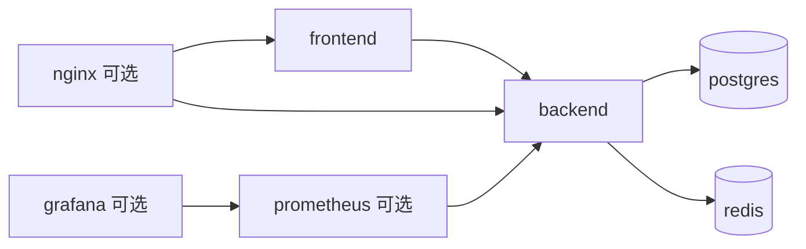

# 族谱管理系统 docker-compose 设计说明

## 1. 文档目的

本文档用于说明族谱管理系统在本地开发、联调和课程演示场景下的 `docker-compose.yml` 编排设计方案。

本文档不直接给出最终 `docker-compose.yml` 文件内容，而是先明确：

- 需要编排哪些服务
- 各服务之间如何连接
- 端口、卷、环境变量如何设计
- 哪些组件是必选，哪些是可选

后续可基于本文档直接生成可执行的 `docker-compose.yml`。

## 2. 编排目标

`docker-compose.yml` 需要满足以下目标：

1. 一键启动前端、后端、数据库和缓存组件。
2. 支持本地开发联调。
3. 支持课程演示时的统一运行环境。
4. 支持数据库持久化和初始化。
5. 尽量减少环境依赖冲突。

## 3. 服务清单

## 3.1 必选服务

### `postgres`

用途：

- 作为系统主数据库
- 存储用户、族谱、成员、关系、婚姻、权限等核心数据

要求：

- 使用 PostgreSQL 17.x 镜像
- 挂载持久化数据卷
- 支持初始化 SQL 或迁移执行

### `redis`

用途：

- 缓存 Dashboard 统计结果
- 存储 Refresh Token 状态或黑名单
- 支撑可选限流能力

要求：

- 使用 Redis 7.4.x 镜像
- 课程项目阶段可采用默认配置

### `backend`

用途：

- 运行 FastAPI 后端服务
- 提供认证、族谱管理、成员管理、查询和统计 API

要求：

- 基于 Python 3.12
- 使用 Uvicorn 启动
- 连接 PostgreSQL 和 Redis
- 支持热更新开发模式

### `frontend`

用途：

- 运行 Vue 前端应用
- 提供登录页、Dashboard、族谱管理、成员管理、查询页面

要求：

- 基于 Node.js 24 LTS
- 使用 Vite 开发服务器
- 能通过环境变量访问后端 API

## 3.2 可选服务

### `nginx`

用途：

- 统一前端静态资源和后端 API 入口
- 反向代理 `/api`

适用场景：

- 演示环境
- 接近部署环境的联调

课程开发阶段不是必须。

### `prometheus`

用途：

- 采集后端和基础服务指标

适用场景：

- 需要展示运行监控时

### `grafana`

用途：

- 展示 Prometheus 指标

适用场景：

- 需要做可观测性展示时

## 4. 推荐服务拓扑



## 5. 服务设计说明

## 5.1 postgres 服务

### 镜像建议

- `postgres:17`

### 端口建议

- 宿主机：`5432`
- 容器：`5432`

### 环境变量建议

- `POSTGRES_DB=family_tree_db`
- `POSTGRES_USER=family_tree_user`
- `POSTGRES_PASSWORD=<secret>`

### 卷挂载建议

- 数据卷：`postgres_data:/var/lib/postgresql/data`
- 初始化脚本目录（可选）：
  - `./deploy/postgres/init:/docker-entrypoint-initdb.d`

### 健康检查建议

- 使用 `pg_isready`

## 5.2 redis 服务

### 镜像建议

- `redis:7.4`

### 端口建议

- 宿主机：`6379`
- 容器：`6379`

### 卷挂载建议

课程项目阶段 Redis 可不做持久化，也可简单挂载：

- `redis_data:/data`

### 健康检查建议

- 使用 `redis-cli ping`

## 5.3 backend 服务

### 构建方式

建议使用本地 `Dockerfile` 构建，而不是直接用官方 Python 镜像裸跑。

### 工作目录建议

- `/app`

### 启动命令建议

开发模式：

```bash
uvicorn app.main:app --host 0.0.0.0 --port 8000 --reload
```

### 端口建议

- 宿主机：`8000`
- 容器：`8000`

### 依赖服务

- `postgres`
- `redis`

### 挂载建议

- 代码目录挂载到容器内，支持热更新
- 可选挂载日志目录

### 环境变量建议

- `APP_ENV=development`
- `APP_HOST=0.0.0.0`
- `APP_PORT=8000`
- `DATABASE_URL=postgresql+asyncpg://family_tree_user:<secret>@postgres:5432/family_tree_db`
- `REDIS_URL=redis://redis:6379/0`
- `JWT_SECRET_KEY=<secret>`
- `JWT_REFRESH_SECRET_KEY=<secret>`
- `ACCESS_TOKEN_EXPIRE_MINUTES=30`
- `REFRESH_TOKEN_EXPIRE_DAYS=7`
- `CORS_ALLOW_ORIGINS=http://localhost:5173`

### 健康检查建议

- 调用后端 `/health`

## 5.4 frontend 服务

### 构建方式

建议使用本地 `Dockerfile` 构建开发镜像。

### 工作目录建议

- `/app`

### 启动命令建议

开发模式：

```bash
npm run dev -- --host 0.0.0.0 --port 5173
```

### 端口建议

- 宿主机：`5173`
- 容器：`5173`

### 挂载建议

- 前端源码目录挂载到容器
- 匿名卷挂载 `node_modules`，避免宿主机与容器依赖冲突

### 环境变量建议

- `VITE_API_BASE_URL=http://localhost:8000`

若经 Nginx 统一代理，则改为：

- `VITE_API_BASE_URL=/api`

## 5.5 nginx 服务（可选）

### 镜像建议

- `nginx:stable`

### 端口建议

- 宿主机：`80`
- 容器：`80`

### 作用

- 转发前端静态资源请求
- 将 `/api` 转发给 `backend:8000`

### 配置挂载建议

- `./deploy/nginx/default.conf:/etc/nginx/conf.d/default.conf:ro`

## 6. 网络设计

建议所有服务处于同一个自定义 Bridge 网络：

- 网络名：`family_tree_network`

这样可获得以下好处：

1. 服务间可通过服务名直接访问
2. 避免依赖宿主机 IP
3. 网络结构简单，适合课程项目

## 7. 卷设计

建议使用以下命名卷：

- `postgres_data`
- `redis_data`

若后续需要挂载日志或上传资源，可再补充：

- `backend_logs`
- `frontend_dist`

## 8. 目录映射建议

假定项目结构如下：

```text
project-root/
  backend/
  frontend/
  deploy/
    nginx/
    postgres/
  docker-compose.yml
```

则建议映射关系如下：

- `./backend -> /app`
- `./frontend -> /app`
- `./deploy/postgres/init -> /docker-entrypoint-initdb.d`
- `./deploy/nginx/default.conf -> /etc/nginx/conf.d/default.conf`

## 9. 环境变量管理建议

不建议将敏感配置直接硬编码在 `docker-compose.yml` 中。

建议使用：

- `.env`
- `backend/.env`
- `frontend/.env.development`

### 建议变量分层

#### 根级 `.env`

用于 Compose 编排层：

- `POSTGRES_DB`
- `POSTGRES_USER`
- `POSTGRES_PASSWORD`
- `JWT_SECRET_KEY`
- `JWT_REFRESH_SECRET_KEY`

#### 后端环境文件

用于 FastAPI：

- `DATABASE_URL`
- `REDIS_URL`
- `ACCESS_TOKEN_EXPIRE_MINUTES`
- `REFRESH_TOKEN_EXPIRE_DAYS`

#### 前端环境文件

用于 Vue：

- `VITE_API_BASE_URL`

## 10. Compose 文件结构建议

`docker-compose.yml` 建议包含以下顶层结构：

```yaml
services:
  postgres:
  redis:
  backend:
  frontend:
  nginx:        # 可选
  prometheus:   # 可选
  grafana:      # 可选

volumes:
  postgres_data:
  redis_data:

networks:
  family_tree_network:
```

## 11. 服务依赖顺序建议

建议使用 `depends_on` 与健康检查配合：

- `backend` 依赖 `postgres`、`redis`
- `frontend` 可独立启动
- `nginx` 依赖 `frontend`、`backend`
- `grafana` 依赖 `prometheus`

注意：

- `depends_on` 只能保证启动顺序，不能保证服务真正可用
- 因此 `backend` 应在启动时处理数据库重连或等待逻辑

## 12. 开发模式与演示模式

## 12.1 开发模式

开发模式下建议：

- `frontend` 使用 Vite Dev Server
- `backend` 使用 Uvicorn `--reload`
- `nginx` 可不启用

优点：

- 调试快
- 热更新方便

## 12.2 演示模式

演示模式下建议：

- `frontend` 先构建静态资源
- `nginx` 提供统一入口
- `backend` 使用稳定启动命令

优点：

- 更接近正式部署
- 入口统一
- 更适合课堂展示

## 13. 不建议纳入首版 Compose 的组件

当前不建议在首版 `docker-compose.yml` 中加入：

- RabbitMQ
- Kafka
- Celery Worker
- Elasticsearch
- MinIO

原因：

1. 会显著增加环境复杂度
2. 当前课程项目没有强需求
3. 影响快速联调与演示稳定性

## 14. 结论

本项目的 `docker-compose.yml` 应至少编排以下核心服务：

- `postgres`
- `redis`
- `backend`
- `frontend`

可选扩展服务包括：

- `nginx`
- `prometheus`
- `grafana`

推荐策略是：

1. 开发阶段使用 `frontend + backend + postgres + redis`
2. 演示阶段增加 `nginx`
3. 若需要展示可观测性，再增加 `prometheus + grafana`

基于这份说明，可以直接进入下一步：生成可执行的 `docker-compose.yml`、后端 `Dockerfile` 和前端 `Dockerfile`。

