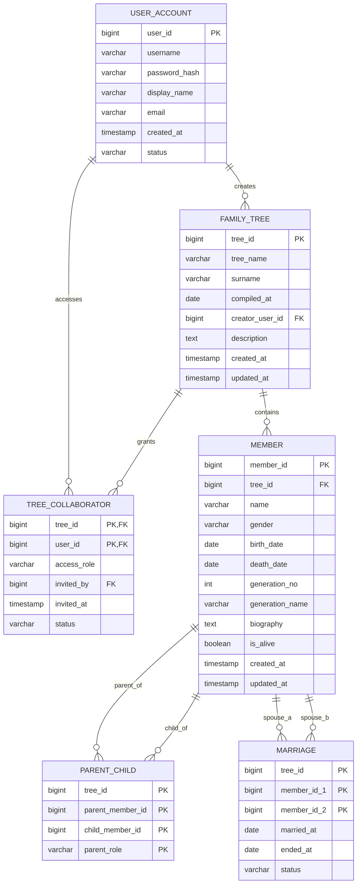

# 族谱管理系统数据库设计文档

## 1. 文档目的与设计依据

本文档用于说明“寻根溯源”族谱管理系统的数据库初步设计方案，作为后续数据库建表、查询编写、界面开发和实验报告撰写的基础材料。

本文档采用 PostgreSQL 常用的小写下划线命名风格，设计依据包括：

- 已整理的业务需求文档
- 当前确认的核心实体与实体关系
- 课程作业对 ER 图、关系模式、约束设计、3NF 说明和后续 SQL 查询的要求

本文档重点覆盖以下内容：

- ER 模型设计
- 关系模式设计
- 主要完整性约束
- PostgreSQL DDL 草案
- 祖先环路防护触发器设计
- 3NF 范式分析与证明

## 2. 数据库设计目标

本数据库设计需要满足以下目标：

1. 支持多用户创建和协作维护多个族谱。
2. 支持创建者、协作者、只读访问者三种族谱访问身份。
3. 支持记录族谱成员的基本信息、血缘关系、婚姻关系与字辈信息。
4. 支持成员树形展示、祖先递归查询、配偶与子女查询、亲缘路径分析。
5. 支持后续统计分析，如按代统计平均寿命、平均出生年份等。
6. 保持逻辑结构规范，避免明显的数据冗余和更新异常，满足第三范式（3NF）。

## 3. ER 模型设计

### 3.1 核心实体

本系统的核心实体包括：

- `user_account`：系统用户
- `family_tree`：族谱
- `member`：族谱成员

### 3.2 联系实体

除核心实体外，还需要以下联系实体来表达多对多关系或带属性的关系：

- `tree_collaborator`：族谱访问授权关系
- `parent_child`：父母子女关系
- `marriage`：婚姻关系

### 3.3 实体关系说明

1. `user_account 1:N family_tree`
   - 一个用户可以创建多个族谱。
   - 一个族谱只能有一个创建者。

2. `user_account M:N family_tree`
   - 一个族谱可以邀请多个用户访问。
   - 一个用户也可以参与多个族谱。
   - 该关系通过 `tree_collaborator` 实现。
   - 访问身份包括：`creator`、`collaborator`、`reader`。

3. `family_tree 1:N member`
   - 一个族谱包含多个成员。
   - 一个成员只属于一个族谱。

4. `member M:N member`（父母子女）
   - 成员之间可以形成父母子女关系。
   - 该关系通过 `parent_child` 实现。

5. `member M:N member`（婚姻）
   - 成员之间可以形成婚姻关系。
   - 该关系通过 `marriage` 实现。

### 3.4 ER 图文字描述

可将 ER 图概括为以下结构：

```text
user_account ──< family_tree
user_account ──< tree_collaborator >── family_tree
family_tree ──< member
member ──< parent_child >── member
member ──< marriage >── member
```

### 3.5 Mermaid ER 图



## 4. 关系模式设计

## 4.1 user_account

**关系模式**

```text
user_account(
  user_id PK,
  username UNIQUE NOT NULL,
  password_hash NOT NULL,
  display_name NOT NULL,
  email UNIQUE,
  created_at NOT NULL,
  status NOT NULL
)
```

**说明**

- `user_id` 为主键。
- `username` 用于登录，应唯一。
- `password_hash` 存储密码摘要，不存明文密码。
- `status` 用于表示账号状态，如 `active`、`disabled`。

## 4.2 family_tree

**关系模式**

```text
family_tree(
  tree_id PK,
  tree_name NOT NULL,
  surname NOT NULL,
  compiled_at,
  creator_user_id FK -> user_account(user_id) NOT NULL,
  description,
  created_at NOT NULL,
  updated_at NOT NULL
)
```

**说明**

- 一个族谱只对应一个创建者。
- `compiled_at` 表示修谱时间。
- `tree_name` 不要求全局唯一。
- 创建者身份由 `creator_user_id` 唯一确定，是访问控制中的最高权限来源。

## 4.3 tree_collaborator

**关系模式**

```text
tree_collaborator(
  tree_id FK -> family_tree(tree_id) NOT NULL,
  user_id FK -> user_account(user_id) NOT NULL,
  access_role NOT NULL,
  invited_by FK -> user_account(user_id) NOT NULL,
  invited_at NOT NULL,
  status NOT NULL,
  PK(tree_id, user_id)
)
```

**说明**

- 表示用户访问族谱的授权关系。
- 同一用户在同一族谱中最多出现一次，因此采用组合主键 `(tree_id, user_id)`。
- 族谱访问身份分为三种：`creator`、`collaborator`、`reader`。
- 其中 `creator` 的唯一事实来源是 `family_tree.creator_user_id`。
- `tree_collaborator` 主要用于记录被邀请访问的非创建者用户，因此常见角色值为 `collaborator` 与 `reader`。

## 4.4 member

**关系模式**

```text
member(
  member_id PK,
  tree_id FK -> family_tree(tree_id) NOT NULL,
  name NOT NULL,
  gender NOT NULL,
  birth_date,
  death_date,
  generation_no,
  generation_name,
  biography,
  is_alive NOT NULL,
  created_at NOT NULL,
  updated_at NOT NULL,
  UNIQUE(tree_id, member_id)
)
```

**说明**

- 一个成员只属于一个族谱。
- 生卒信息采用完整日期建模，便于后续年龄计算。
- `generation_no` 显式保存代际编号，用于后续按辈分统计。
- `generation_name` 用于保存字辈、派语或辈分字等扩展信息，便于展示、检索和后续分析。
- `UNIQUE(tree_id, member_id)` 用于支持后续跨表的复合外键约束。

## 4.5 parent_child

**关系模式**

```text
parent_child(
  tree_id NOT NULL,
  parent_member_id NOT NULL,
  child_member_id NOT NULL,
  parent_role NOT NULL,
  PK(tree_id, parent_member_id, child_member_id, parent_role),
  FK(tree_id, parent_member_id) -> member(tree_id, member_id),
  FK(tree_id, child_member_id) -> member(tree_id, member_id),
  UNIQUE(tree_id, child_member_id, parent_role)
)
```

**说明**

- 用于表示父母子女关系。
- `parent_role` 用来区分 `father` 和 `mother`。
- `UNIQUE(tree_id, child_member_id, parent_role)` 表示同一族谱中，一个孩子最多对应一个父亲和一个母亲。

## 4.6 marriage

**关系模式**

```text
marriage(
  tree_id NOT NULL,
  member_id_1 NOT NULL,
  member_id_2 NOT NULL,
  married_at,
  ended_at,
  status,
  PK(tree_id, member_id_1, member_id_2),
  FK(tree_id, member_id_1) -> member(tree_id, member_id),
  FK(tree_id, member_id_2) -> member(tree_id, member_id)
)
```

**说明**

- 用于表示婚姻关系。
- 为避免同一对婚姻关系重复存储两次，约定 `member_id_1 < member_id_2`。
- `status` 可用于区分在婚、结束等状态。

## 5. 主要完整性约束设计

## 5.1 实体完整性

- 每张核心表都必须设置主键。
- 主键不能为空，且主键值唯一。

## 5.2 参照完整性

- `family_tree.creator_user_id` 必须引用合法用户。
- `tree_collaborator.tree_id` 必须引用合法族谱。
- `tree_collaborator.user_id` 和 `invited_by` 必须引用合法用户。
- `member.tree_id` 必须引用合法族谱。
- `parent_child` 和 `marriage` 中引用的成员必须存在。

## 5.3 业务完整性约束

建议在逻辑设计中明确以下规则：

1. 成员关系不能跨族谱建立。
2. `death_date >= birth_date`。
3. `parent_member_id <> child_member_id`。
4. `member_id_1 <> member_id_2`。
5. `member_id_1 < member_id_2`。
6. `parent_role` 只允许取 `father` 或 `mother`。
7. 同一孩子在同一族谱中最多一个父亲、最多一个母亲。
8. `tree_collaborator.access_role` 只允许取 `collaborator` 或 `reader`；创建者身份由 `family_tree.creator_user_id` 表示。
9. 当 `is_alive = true` 时，`death_date` 应为空。

此外，还有以下约束不适合仅用普通 `CHECK` 实现，但应在设计文档中明确：

- 父亲出生日期必须早于子女出生日期。
- 母亲出生日期必须早于子女出生日期。
- 不应出现祖先环路。

其中，“不应出现祖先环路”建议在 PostgreSQL 中通过触发器实现，而不是只停留在应用层约束。

## 6. PostgreSQL DDL 草案

以下 DDL 作为逻辑设计对应的 PostgreSQL 建表草案。

```sql
CREATE TABLE user_account (
    user_id BIGSERIAL PRIMARY KEY,
    username VARCHAR(50) NOT NULL UNIQUE,
    password_hash VARCHAR(255) NOT NULL,
    display_name VARCHAR(100) NOT NULL,
    email VARCHAR(100) UNIQUE,
    created_at TIMESTAMP NOT NULL DEFAULT CURRENT_TIMESTAMP,
    status VARCHAR(20) NOT NULL DEFAULT 'active',
    CONSTRAINT chk_user_status
        CHECK (status IN ('active', 'disabled'))
);

CREATE TABLE family_tree (
    tree_id BIGSERIAL PRIMARY KEY,
    tree_name VARCHAR(100) NOT NULL,
    surname VARCHAR(50) NOT NULL,
    compiled_at DATE,
    creator_user_id BIGINT NOT NULL,
    description TEXT,
    created_at TIMESTAMP NOT NULL DEFAULT CURRENT_TIMESTAMP,
    updated_at TIMESTAMP NOT NULL DEFAULT CURRENT_TIMESTAMP,
    CONSTRAINT fk_tree_creator
        FOREIGN KEY (creator_user_id)
        REFERENCES user_account(user_id)
);

CREATE TABLE tree_collaborator (
    tree_id BIGINT NOT NULL,
    user_id BIGINT NOT NULL,
    access_role VARCHAR(20) NOT NULL,
    invited_by BIGINT NOT NULL,
    invited_at TIMESTAMP NOT NULL DEFAULT CURRENT_TIMESTAMP,
    status VARCHAR(20) NOT NULL DEFAULT 'active',
    CONSTRAINT pk_tree_collaborator
        PRIMARY KEY (tree_id, user_id),
    CONSTRAINT fk_collab_tree
        FOREIGN KEY (tree_id)
        REFERENCES family_tree(tree_id),
    CONSTRAINT fk_collab_user
        FOREIGN KEY (user_id)
        REFERENCES user_account(user_id),
    CONSTRAINT fk_collab_invited_by
        FOREIGN KEY (invited_by)
        REFERENCES user_account(user_id),
    CONSTRAINT chk_collab_role
        CHECK (access_role IN ('collaborator', 'reader')),
    CONSTRAINT chk_collab_status
        CHECK (status IN ('active', 'revoked', 'pending'))
);

CREATE TABLE member (
    member_id BIGSERIAL PRIMARY KEY,
    tree_id BIGINT NOT NULL,
    name VARCHAR(100) NOT NULL,
    gender VARCHAR(10) NOT NULL,
    birth_date DATE,
    death_date DATE,
    generation_no INT,
    generation_name VARCHAR(50),
    biography TEXT,
    is_alive BOOLEAN NOT NULL DEFAULT TRUE,
    created_at TIMESTAMP NOT NULL DEFAULT CURRENT_TIMESTAMP,
    updated_at TIMESTAMP NOT NULL DEFAULT CURRENT_TIMESTAMP,
    CONSTRAINT uq_member_tree_member
        UNIQUE (tree_id, member_id),
    CONSTRAINT fk_member_tree
        FOREIGN KEY (tree_id)
        REFERENCES family_tree(tree_id),
    CONSTRAINT chk_member_gender
        CHECK (gender IN ('male', 'female', 'unknown')),
    CONSTRAINT chk_member_life_span
        CHECK (
            birth_date IS NULL
            OR death_date IS NULL
            OR death_date >= birth_date
        ),
    CONSTRAINT chk_member_alive_death
        CHECK (
            is_alive = FALSE
            OR death_date IS NULL
        ),
    CONSTRAINT chk_generation_no_positive
        CHECK (
            generation_no IS NULL
            OR generation_no > 0
        )
);

CREATE TABLE parent_child (
    tree_id BIGINT NOT NULL,
    parent_member_id BIGINT NOT NULL,
    child_member_id BIGINT NOT NULL,
    parent_role VARCHAR(10) NOT NULL,
    CONSTRAINT pk_parent_child
        PRIMARY KEY (tree_id, parent_member_id, child_member_id, parent_role),
    CONSTRAINT fk_pc_parent
        FOREIGN KEY (tree_id, parent_member_id)
        REFERENCES member(tree_id, member_id),
    CONSTRAINT fk_pc_child
        FOREIGN KEY (tree_id, child_member_id)
        REFERENCES member(tree_id, member_id),
    CONSTRAINT uq_child_parent_role
        UNIQUE (tree_id, child_member_id, parent_role),
    CONSTRAINT chk_parent_role
        CHECK (parent_role IN ('father', 'mother')),
    CONSTRAINT chk_parent_not_self
        CHECK (parent_member_id <> child_member_id)
);

CREATE TABLE marriage (
    tree_id BIGINT NOT NULL,
    member_id_1 BIGINT NOT NULL,
    member_id_2 BIGINT NOT NULL,
    married_at DATE,
    ended_at DATE,
    status VARCHAR(20) DEFAULT 'active',
    CONSTRAINT pk_marriage
        PRIMARY KEY (tree_id, member_id_1, member_id_2),
    CONSTRAINT fk_marriage_member_1
        FOREIGN KEY (tree_id, member_id_1)
        REFERENCES member(tree_id, member_id),
    CONSTRAINT fk_marriage_member_2
        FOREIGN KEY (tree_id, member_id_2)
        REFERENCES member(tree_id, member_id),
    CONSTRAINT chk_marriage_distinct
        CHECK (member_id_1 <> member_id_2),
    CONSTRAINT chk_marriage_order
        CHECK (member_id_1 < member_id_2),
    CONSTRAINT chk_marriage_status
        CHECK (status IN ('active', 'ended'))
);
```

## 6.1 祖先环路触发器设计

为防止在 `parent_child` 中插入会形成祖先闭环的数据，需要增加触发器。

```sql
CREATE OR REPLACE FUNCTION prevent_parent_child_cycle()
RETURNS TRIGGER AS $$
DECLARE
    cycle_found BOOLEAN;
BEGIN
    IF NEW.parent_member_id = NEW.child_member_id THEN
        RAISE EXCEPTION 'parent_member_id and child_member_id cannot be identical';
    END IF;

    WITH RECURSIVE ancestor_path AS (
        SELECT
            pc.tree_id,
            pc.parent_member_id,
            pc.child_member_id
        FROM parent_child pc
        WHERE pc.tree_id = NEW.tree_id
          AND pc.child_member_id = NEW.parent_member_id

        UNION ALL

        SELECT
            pc.tree_id,
            pc.parent_member_id,
            pc.child_member_id
        FROM ancestor_path ap
        JOIN parent_child pc
          ON pc.tree_id = ap.tree_id
         AND pc.child_member_id = ap.parent_member_id
    )
    SELECT EXISTS (
        SELECT 1
        FROM ancestor_path
        WHERE parent_member_id = NEW.child_member_id
    )
    INTO cycle_found;

    IF cycle_found THEN
        RAISE EXCEPTION
            'adding parent-child relation (tree_id=%, parent_member_id=%, child_member_id=%) would create an ancestor cycle',
            NEW.tree_id, NEW.parent_member_id, NEW.child_member_id;
    END IF;

    RETURN NEW;
END;
$$ LANGUAGE plpgsql;

CREATE TRIGGER trg_prevent_parent_child_cycle
BEFORE INSERT OR UPDATE ON parent_child
FOR EACH ROW
EXECUTE FUNCTION prevent_parent_child_cycle();
```

**说明**

- 该触发器在插入或更新 `parent_child` 记录前执行。
- 核心判断逻辑是：若 `NEW.child_member_id` 已经位于 `NEW.parent_member_id` 的祖先链上，则新边会形成环路，操作应被拒绝。
- 该设计能够防止出现 `A -> B -> C -> A` 这类祖先闭环。
- 该触发器与普通 `CHECK` 不同，它依赖递归查询已有关系，因此必须通过 `plpgsql` 触发器实现。

## 7. 范式分析与 3NF 证明

## 7.1 3NF 判定标准

设关系模式中存在函数依赖 `X -> A`，若对每一个非平凡函数依赖都满足以下条件之一，则该关系模式满足第三范式（3NF）：

1. `X` 是该关系模式的超键；
2. `A` 是主属性，即属于某个候选键的属性。

通俗地说，3NF 要求：

- 不存在非主属性对主键的部分依赖；
- 不存在非主属性对主键的传递依赖；
- 每个非主属性都应直接依赖于键，而不是依赖于其他非主属性。

下面对每张表分别分析。

## 7.2 user_account 表的 3NF 分析

关系模式：

```text
user_account(user_id, username, password_hash, display_name, email, created_at, status)
```

候选键：

- `user_id`
- `username`
- `email`（若允许为空，则只在非空记录中具唯一性，逻辑上不作为主候选键进行证明时的主要依据）

主要函数依赖可写为：

- `user_id -> username, password_hash, display_name, email, created_at, status`
- `username -> user_id, password_hash, display_name, email, created_at, status`

分析：

- 所有非主属性都直接依赖于候选键 `user_id` 或 `username`。
- 表中不存在组合主键，因此不存在部分依赖。
- `display_name`、`status`、`created_at` 等属性不依赖于其他非主属性，因此不存在传递依赖。

结论：

- `user_account` 满足 3NF。

## 7.3 family_tree 表的 3NF 分析

关系模式：

```text
family_tree(tree_id, tree_name, surname, compiled_at, creator_user_id, description, created_at, updated_at)
```

候选键：

- `tree_id`

主要函数依赖：

- `tree_id -> tree_name, surname, compiled_at, creator_user_id, description, created_at, updated_at`

分析：

- 所有非主属性均完全依赖于主键 `tree_id`。
- 不存在组合键，因此不存在部分依赖。
- 例如 `surname` 不决定 `creator_user_id`，`creator_user_id` 也不决定 `tree_name`，各属性之间不存在对主键的传递依赖。

结论：

- `family_tree` 满足 3NF。

## 7.4 tree_collaborator 表的 3NF 分析

关系模式：

```text
tree_collaborator(tree_id, user_id, access_role, invited_by, invited_at, status)
```

候选键：

- `(tree_id, user_id)`

主要函数依赖：

- `(tree_id, user_id) -> access_role, invited_by, invited_at, status`

分析：

- `access_role`、`invited_by`、`invited_at`、`status` 都表示“某用户访问某族谱”这条授权记录的属性。
- 这些属性不能仅由 `tree_id` 决定，也不能仅由 `user_id` 决定，必须依赖组合键 `(tree_id, user_id)`。
- 因此不存在对组合键的部分依赖。
- 非主属性之间也不存在传递依赖。

结论：

- `tree_collaborator` 满足 3NF。

## 7.5 member 表的 3NF 分析

关系模式：

```text
member(member_id, tree_id, name, gender, birth_date, death_date, generation_no, generation_name, biography, is_alive, created_at, updated_at)
```

候选键：

- `member_id`

主要函数依赖：

- `member_id -> tree_id, name, gender, birth_date, death_date, generation_no, generation_name, biography, is_alive, created_at, updated_at`

分析：

- 所有非主属性都由 `member_id` 唯一决定。
- 不存在组合主键，因此不存在部分依赖。
- `generation_no` 与 `generation_name` 虽然在业务上都与辈分概念相关，但在当前设计中它们作为成员属性显式存储，均直接依赖于 `member_id`，不构成传递依赖。
- `is_alive` 可能与 `death_date` 存在业务关联，但它不是通过另一个非主属性来决定主键，也不形成对主键的传递依赖。在逻辑设计中，它只是为了便于查询和校验而保留的成员状态属性。

结论：

- `member` 满足 3NF。

## 7.6 parent_child 表的 3NF 分析

关系模式：

```text
parent_child(tree_id, parent_member_id, child_member_id, parent_role)
```

候选键：

- `(tree_id, parent_member_id, child_member_id, parent_role)`

附加唯一约束：

- `(tree_id, child_member_id, parent_role)`

主要函数依赖：

- `(tree_id, parent_member_id, child_member_id, parent_role)` 本身唯一标识一条父母子女关系记录

分析：

- 该表除键属性外没有其他非主属性。
- 一个关系模式如果所有属性都属于候选键，则天然不存在非主属性对键的部分依赖或传递依赖问题。
- 因此该表不仅满足 3NF，而且满足更强的 BCNF。

结论：

- `parent_child` 满足 3NF，且满足 BCNF。

## 7.7 marriage 表的 3NF 分析

关系模式：

```text
marriage(tree_id, member_id_1, member_id_2, married_at, ended_at, status)
```

候选键：

- `(tree_id, member_id_1, member_id_2)`

主要函数依赖：

- `(tree_id, member_id_1, member_id_2) -> married_at, ended_at, status`

分析：

- `married_at`、`ended_at`、`status` 都描述某一对成员在某族谱中的婚姻关系。
- 它们不能只依赖 `member_id_1`，也不能只依赖 `member_id_2`，必须依赖完整组合键。
- 不存在对组合键的部分依赖。
- 非主属性之间也不存在传递依赖。

结论：

- `marriage` 满足 3NF。

## 7.8 全局结论

综合以上分析，本设计满足 3NF，理由如下：

1. 每张表都只描述一个明确主题。
2. 多对多关系均拆分为独立联系表，没有将重复组或多值属性放入单一字段。
3. 所有非主属性都直接依赖于主键或候选键。
4. 不存在明显的部分依赖和传递依赖。
5. `parent_child` 和 `marriage` 这类关系表避免了把关系信息冗余存入 `member` 表，从而降低了更新异常风险。

因此，该数据库逻辑结构符合第三范式要求，可满足课程作业对 3NF 的设计要求。

## 8. 对课程任务的支撑说明

本设计能够支撑课程要求中的主要功能和查询任务：

1. **用户权限范围**
   - `user_account`、`family_tree`、`tree_collaborator` 可支持“查看自己创建或受邀参与的族谱”。
   - 访问身份可区分为创建者、协作者、只读访问者。

2. **成员管理**
   - `member` 可支持成员增删改查、模糊查找、字辈展示和基础信息展示。

3. **树形预览与祖先查询**
   - `parent_child` 可支持递归公用表表达式（Recursive CTE）进行祖先追溯和后代查询。
   - 防祖先环路触发器可以保证递归关系结构保持有向无环。

4. **配偶与子女查询**
   - `marriage` 支持查配偶。
   - `parent_child` 支持查某成员的所有子女。

5. **统计分析**
   - `generation_no`、`generation_name`、`birth_date`、`death_date` 可支持按代统计平均寿命、比较出生年份及字辈展示等查询。

6. **亲缘关系路径分析**
   - `parent_child` 与 `marriage` 共同构成成员关系网络，可作为后续路径查询的基础。

## 9. 设计取舍与后续扩展说明

当前版本属于初步数据库设计，主要面向课程作业与后续实现。以下内容暂未展开，但后续可按需要扩展：

- 父母出生日期早于子女的跨表触发器
- 更细粒度的访问权限控制，例如“只读访问者不可修改成员关系”
- 成员别名、排行、籍贯、重要事件等扩展字段
- 家族分支表、地点表、事件表等增强实体
- 针对模糊姓名检索和父节点查子节点的索引设计

当前设计已经具备以下特征：

- 结构完整，可转换为建表脚本
- 范式规范，可用于课程报告
- 能支撑后续 SQL 查询、访问控制和性能优化实验
