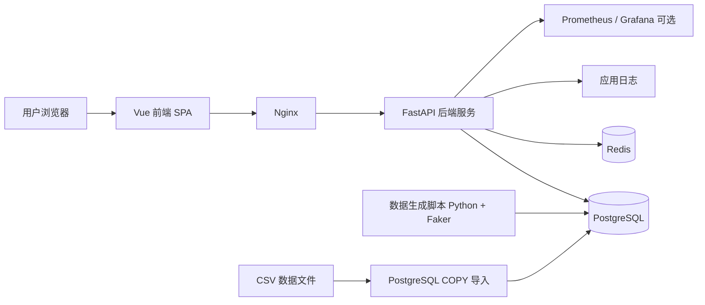

# 族谱管理系统系统架构设计文档

## 1. 文档目的与适用范围

本文档用于说明“寻根溯源”族谱管理系统的整体系统架构设计，面向课程项目实现、团队协作开发、环境搭建和后续扩展。

本文档重点回答以下问题：

- 当前给定技术栈是否足够覆盖系统架构设计
- 还需要补充哪些必要技术组件
- 系统应采用什么总体架构形态
- 前后端、数据库、中间件之间如何协作
- 开发环境和部署环境需要哪些依赖及版本要求

本文档定位为“课程项目增强版”架构设计文档：不采用过重的企业级复杂中间件，但保留前后端分离、认证鉴权、缓存、日志、监控和容器化部署等必要能力。

## 2. 技术栈评估结论

### 2.1 已覆盖的内容

你给出的初始技术栈如下：

- 后端：Python FastAPI
- 前端：Vue
- 数据库：PostgreSQL
- ORM：SQLAlchemy
- 复杂查询：原生 SQL + Recursive CTE
- 数据生成：Python + Faker
- 数据导入：PostgreSQL COPY
- 性能分析：EXPLAIN ANALYZE

这套技术栈已经覆盖了本项目的核心实现能力，具体包括：

1. **Web 应用前后端主框架**
   - Vue 可以承担前端单页应用开发
   - FastAPI 可以承担 REST API 开发

2. **数据存储与数据访问**
   - PostgreSQL 能很好支持递归查询、复杂聚合和 `EXPLAIN ANALYZE`
   - SQLAlchemy 能承担常规 CRUD 与模型映射

3. **复杂查询实现路径**
   - 原生 SQL + Recursive CTE 与本项目的祖先查询、后代查询、关系链路查询高度匹配

4. **测试数据与实验支撑**
   - Python + Faker 能满足大规模模拟数据生成
   - PostgreSQL `COPY` 能满足 CSV 批量导入
   - `EXPLAIN ANALYZE` 能满足课程要求中的性能对比分析

因此，**这套技术栈已经足以覆盖“核心业务实现”层面**。

### 2.2 仍需补充的内容

如果要形成完整的系统架构设计文档，仅有上述主干技术还不够，还需要补充以下内容：

1. **前端工程化组件**
   - 构建工具：`Vite`
   - 路由管理：`Vue Router`
   - 状态管理：`Pinia`
   - HTTP 客户端：`Axios`

2. **后端运行与迁移组件**
   - ASGI Server：`Uvicorn`
   - 数据库迁移工具：`Alembic`
   - 数据校验模型：`Pydantic v2`

3. **认证与权限组件**
   - `JWT Access Token + Refresh Token`
   - 密码哈希：`Argon2`

4. **必要中间件**
   - 反向代理：`Nginx`
   - 轻量缓存与会话辅助：`Redis`

5. **可观测性能力**
   - 结构化日志
   - 健康检查接口
   - 可选监控：`Prometheus + Grafana`

6. **环境管理方式**
   - `Docker Compose`
   - 本机原生安装方案

结论是：**主干技术栈足够，但要形成完整的系统架构设计文档，仍需补充工程化、中间件、认证和环境依赖说明。**

## 3. 总体架构选型

## 3.1 架构模式

本项目采用以下总体架构模式：

- **前后端分离架构**
- **单体后端服务**
- **关系型数据库为核心数据源**
- **Redis 作为辅助中间件**

即：

- 前端采用 Vue 单页应用（SPA）
- 后端采用 FastAPI 提供 REST API
- PostgreSQL 负责持久化存储与复杂查询
- Redis 负责缓存、刷新令牌辅助存储和可选限流辅助
- Nginx 负责反向代理与静态资源分发

本项目**不采用微服务架构**，原因如下：

1. 课程项目规模有限，单体架构更适合快速实现和调试。
2. 业务边界集中在族谱、成员、关系、权限四个核心域，拆微服务收益很低。
3. 复杂查询强依赖 PostgreSQL，服务拆分反而会增加跨服务调用成本。

## 3.2 总体架构图



## 4. 技术选型总览

## 4.1 前端技术选型

- 框架：`Vue 3`
- 构建工具：`Vite`
- 路由：`Vue Router`
- 状态管理：`Pinia`
- HTTP 客户端：`Axios`

**选型理由**

1. Vue 3 适合中小型管理系统界面开发，学习成本和工程复杂度较低。
2. Vite 启动快、构建简单，适合课程项目和前后端分离开发。
3. Vue Router 适合登录页、Dashboard、族谱详情页、成员详情页等路由组织。
4. Pinia 适合集中管理用户信息、当前族谱、权限状态等全局状态。
5. Axios 便于统一处理鉴权头、请求拦截和错误响应。

## 4.2 后端技术选型

- Web 框架：`FastAPI`
- 运行服务：`Uvicorn`
- 数据校验：`Pydantic v2`
- ORM：`SQLAlchemy 2.0`
- 迁移工具：`Alembic`

**选型理由**

1. FastAPI 对 REST API、数据模型校验和 OpenAPI 文档支持较好。
2. FastAPI 与 Pydantic、SQLAlchemy 生态结合成熟。
3. Uvicorn 是标准 ASGI 运行服务，适合本项目部署方式。
4. Alembic 可以支撑数据库版本管理，避免手工维护建表脚本失控。

## 4.3 数据访问方案

本项目采用：

- **ORM 负责常规 CRUD**
- **原生 SQL 负责复杂查询**
- **Recursive CTE 负责递归家谱关系计算**

具体约定如下：

1. 常规查询：
   - 用户信息
   - 族谱列表
   - 成员增删改查
   - 协作者维护
   - 使用 SQLAlchemy ORM

2. 复杂查询：
   - 祖先递归查询
   - 某分支树形预览
   - 两人亲缘路径查询
   - 平均寿命最长的一代
   - 出生年份早于本代平均出生年份成员
   - 使用 SQLAlchemy 执行原生 SQL 文本

3. 数据访问主链路：
   - **FastAPI + SQLAlchemy AsyncSession + asyncpg**
   - 批量导入与离线数据脚本可单独使用 `psycopg3`

**选型理由**

1. 族谱系统的递归与统计分析查询并不适合完全 ORM 化。
2. PostgreSQL 对 Recursive CTE 支持成熟，直接使用原生 SQL 更清晰、可控。
3. 采用异步主链路有利于接口服务保持较好的并发处理能力。

## 4.4 数据与离线任务技术选型

- 模拟数据生成：`Python + Faker`
- 数据导入：`PostgreSQL COPY`
- 性能分析：`EXPLAIN ANALYZE`

**选型理由**

1. Python + Faker 适合快速生成大规模成员、关系、婚姻和族谱数据。
2. `COPY` 导入效率远高于逐条插入，适合十万级数据导入。
3. `EXPLAIN ANALYZE` 是课程要求中的核心性能分析手段。

## 4.5 中间件与辅助组件

### 必要中间件

- `Nginx`
- `Redis`

### 推荐增强组件

- `Prometheus`
- `Grafana`

### 暂不纳入首版硬依赖

- 消息队列（如 RabbitMQ、Kafka）
- 分布式任务系统（如 Celery）
- 搜索引擎（如 Elasticsearch）
- 对象存储（如 MinIO）
- API Gateway

**理由**

本项目属于课程项目增强版，加入 Redis、Nginx、日志、健康检查已经足够覆盖多数工程要求。过早引入消息队列、搜索引擎等会提高复杂度，但对当前任务收益有限。

## 5. 系统分层设计

## 5.1 前端分层

前端建议采用以下分层：

- `views/`：页面级视图
- `components/`：通用组件
- `router/`：路由定义
- `stores/`：Pinia 状态管理
- `api/`：接口调用封装
- `composables/`：可复用逻辑

典型页面包括：

- 登录页
- 注册页
- Dashboard
- 族谱列表页
- 族谱详情页
- 成员详情页
- 祖先查询页
- 亲缘路径查询页

## 5.2 后端分层

后端建议采用以下分层：

- `api` 层：路由、请求接收、响应返回
- `service` 层：业务逻辑
- `repository/query` 层：
  - `repository` 负责常规 ORM 数据访问
  - `query` 负责原生 SQL 和递归查询
- `model` 层：SQLAlchemy 模型
- `schema` 层：Pydantic 模型

### 推荐目录示意

```text
backend/
  app/
    api/
    core/
    db/
    models/
    schemas/
    services/
    repositories/
    queries/
    utils/
  alembic/
```

## 5.3 数据访问分工

- `repositories/`
  - 用户、族谱、成员、协作者等常规 CRUD
- `queries/`
  - Recursive CTE 查询
  - 聚合统计查询
  - 原生 SQL 优化查询

这样做的好处是：

1. 避免 ORM 与复杂 SQL 混写。
2. 便于后续对复杂查询做性能调优。
3. 便于在实验报告中单独整理课程要求 SQL。

## 6. 认证与权限控制设计

## 6.1 认证方案

本项目前后端分离，采用：

- `JWT Access Token`
- `Refresh Token`

认证流程如下：

1. 用户登录成功后，后端签发短期有效的 Access Token。
2. 后端同时签发长期有效的 Refresh Token。
3. 前端在 Access Token 过期时，使用 Refresh Token 换取新令牌。
4. 后端可结合 Redis 管理 Refresh Token 状态或黑名单。

## 6.2 权限模型

族谱访问身份分为三类：

- `creator`：创建者
- `collaborator`：协作者
- `reader`：只读访问者

权限建议如下：

1. `creator`
   - 可查看、修改、删除自己创建的族谱
   - 可邀请协作者和只读访问者
   - 可维护族谱成员与关系

2. `collaborator`
   - 可查看族谱
   - 可新增、修改成员信息和关系
   - 默认不可删除整个族谱

3. `reader`
   - 只能查看族谱、成员、统计和关系图
   - 不可修改数据

## 6.3 密码与安全

- 密码哈希算法：`Argon2`
- 前后端跨域：FastAPI `CORS` 中间件
- 生产环境应开启 HTTPS（由 Nginx 终止 TLS）

## 7. 缓存、中间件与可观测性设计

## 7.1 Redis 用途

Redis 在本项目中作为辅助中间件，建议承担以下职责：

1. Dashboard 统计缓存
2. Refresh Token 状态存储或黑名单
3. 简单限流辅助存储
4. 可选的热点查询缓存

本项目不建议把 Redis 作为主数据源，也不建议把成员关系数据长期复制到 Redis 中。

## 7.2 Nginx 用途

Nginx 主要承担以下职责：

1. 前端静态资源分发
2. `/api` 请求反向代理到 FastAPI
3. HTTPS 入口
4. 可选压缩与缓存头配置

## 7.3 日志与监控

基础要求：

- 后端输出结构化日志
- 区分应用日志、认证异常日志、数据库异常日志
- 提供健康检查接口，如 `/health`

推荐增强：

- `Prometheus` 采集基础指标
- `Grafana` 展示运行状态和数据库性能趋势

## 8. 开发环境与部署环境版本要求

以下版本要求以 2026-05-10 为基准，优先采用官方稳定版本线。

## 8.1 开发环境推荐版本

### 操作系统

- Windows：`Windows 11`
- Linux：`Ubuntu 22.04+`
- macOS：`macOS 14+`

### 后端运行环境

- Python：**推荐 `3.12.13`**，最低 `3.11`
- FastAPI：**推荐 `0.128.3`**
- Uvicorn：建议使用与 FastAPI 0.128.x 兼容的当前稳定版
- Pydantic：**推荐 `2.12.5`**
- SQLAlchemy：**推荐 `2.0.49`**
- Alembic：**推荐 `1.18.4`**
- asyncpg：建议 `0.30.x` 或与 SQLAlchemy 2.0 异步方案兼容的当前稳定版
- psycopg：建议 `3.2.x`
- Faker：建议 `37.x` 左右的当前稳定版，最终以锁文件为准

### 前端运行环境

- Node.js：**推荐 `24.11.0 LTS`**，最低 `22 LTS`
- Vue：**推荐 `3.5.34`**
- Vite：**推荐 `8.x`**
- Vue Router：**推荐 `4.6.3`**
- Pinia：**推荐 `3.0.4`**
- Axios：建议 `1.x`

### 数据与中间件

- PostgreSQL：**推荐 `17.9`**，最低 `16.x`
- Redis：**推荐 `7.4.8`** 或同一稳定版本线
- Nginx：建议 `1.26.x` 或当前稳定版

### 容器环境

- Docker Engine：**推荐 `29.4.x`**
- Docker Desktop：**推荐 `4.69.x`**
- Docker Compose：建议 `v2.x`

## 8.2 部署环境推荐版本

部署环境建议优先使用 Linux：

- OS：`Ubuntu 24.04 LTS`
- Python：`3.12.x`
- Node.js：仅构建阶段需要 `24 LTS`
- PostgreSQL：`17.x`
- Redis：`7.4.x`
- Docker Engine：`29.x`
- Nginx：稳定版

## 9. 两套环境依赖方案

## 9.1 方案 A：Docker Compose

推荐作为主方案。

### 组件

- `frontend`
- `backend`
- `postgres`
- `redis`
- 可选 `nginx`
- 可选 `prometheus`
- 可选 `grafana`

### 优点

1. 环境一致性好
2. 便于课程演示和团队协作
3. 降低本机依赖冲突

### 适用场景

- 课程作业演示
- 团队联合开发
- 提交可复现环境

## 9.2 方案 B：本机原生安装

适合作为兼容方案。

### 本机依赖

- Python 3.12
- Node.js 24 LTS
- PostgreSQL 17
- Redis 7.4（可选但推荐）
- Git

### Python 环境

- 使用 `venv` 或 `uv` 管理虚拟环境

### 前端环境

- 使用 `npm`、`pnpm` 或 `yarn`
- 推荐 `pnpm` 或 `npm`

### 适用场景

- 单人开发
- 本地快速调试
- 不使用容器时的课程实验环境

## 10. 部署拓扑设计

## 10.1 开发环境拓扑

```text
Browser
  -> Vue Dev Server / Vite
  -> FastAPI(Uvicorn)
  -> PostgreSQL
  -> Redis
```

## 10.2 生产/演示环境拓扑

```text
Browser
  -> Nginx
     -> Vue Static Files
     -> FastAPI API Service
         -> PostgreSQL
         -> Redis
```

## 11. 技术选型取舍说明

## 11.1 为什么选择 FastAPI 而不是 Django

1. 本项目以后端 API 为主，FastAPI 更贴合前后端分离模式。
2. 自动生成 OpenAPI 文档有利于前后端协作。
3. 与 Pydantic、异步 IO、SQLAlchemy 2.0 的结合较自然。

## 11.2 为什么复杂查询不用 ORM 完全表达

1. 祖先、后代、关系路径查询天然适合 Recursive CTE。
2. 用 ORM 强行表达会让 SQL 可读性和可维护性下降。
3. 课程作业需要提交原生 SQL 与执行计划，原生 SQL 更合适。

## 11.3 为什么选择 Redis 而不引入消息队列

1. 当前项目没有明显的异步任务洪峰场景。
2. Redis 足以覆盖缓存、令牌管理和简单限流需求。
3. 任务队列会显著提升课程项目复杂度。

## 11.4 为什么采用单体架构

1. 当前业务边界集中，不需要服务拆分。
2. 微服务会增加部署、认证和调试复杂度。
3. 课程项目更需要稳定完成核心功能，而不是引入不必要的分布式设计。

## 12. 风险与后续扩展方向

当前架构的主要风险包括：

1. 亲缘路径查询在十万级数据下可能存在性能压力。
2. Redis 缓存策略若设计不当，可能带来数据一致性问题。
3. 若前端树形视图一次性渲染过深分支，可能出现界面性能问题。

后续扩展方向包括：

1. 为高频统计结果增加更细的缓存策略
2. 为复杂图遍历增加搜索深度控制
3. 增加后台任务系统处理大规模数据生成与导入
4. 增加审计日志与操作留痕
5. 若后续确有需求，再补充消息队列或对象存储

## 13. 结论

对于本项目而言，以下架构结论成立：

1. 你给出的原始技术栈已经覆盖了系统实现主干。
2. 若要形成完整的系统架构设计文档，还必须补充：
   - Vite
   - Vue Router
   - Pinia
   - Axios
   - Uvicorn
   - Pydantic v2
   - Alembic
   - JWT + Refresh Token
   - Argon2
   - Nginx
   - Redis
   - Docker Compose
   - 健康检查、日志、监控方案
3. 本项目最适合的架构形态是：
   - Vue SPA
   - FastAPI 单体 API
   - PostgreSQL 作为核心数据源
   - SQLAlchemy 负责常规数据访问
   - 原生 SQL + Recursive CTE 负责复杂查询
   - Redis 作为辅助中间件

该技术选型兼顾了课程项目可实现性、查询复杂度、后续扩展能力和工程规范性，适合作为本项目的正式系统架构方案。

## 14. 参考依据

以下版本与技术说明参考官方资料整理：

- Python 版本文档：https://www.python.org/doc/versions/
- Python 3.12 发布页：https://www.python.org/downloads/release/python-3120/
- Node.js 发布页：https://nodejs.org/en/download/releases/
- Node.js 24 LTS 说明：https://nodejs.org/en/blog/release/v24.11.0
- PostgreSQL 文档主页：https://www.postgresql.org/docs/
- PostgreSQL 版本策略：https://www.postgresql.org/support/versioning/
- FastAPI Release Notes：https://fastapi.tiangolo.com/release-notes/
- SQLAlchemy 官网与 2.0 文档：
  - https://www.sqlalchemy.org/
  - https://docs.sqlalchemy.org/20/intro.html
- Alembic 文档：https://alembic.sqlalchemy.org/en/latest/
- Vue 发布说明：https://vuejs.org/about/releases
- Vue Core Releases：https://github.com/vuejs/core/releases
- Vite 发布说明：https://vite.dev/releases
- Vue Router 文档与 Releases：
  - https://router.vuejs.org/
  - https://github.com/vuejs/router/releases
- Pinia 文档与 Releases：
  - https://pinia.vuejs.org/
  - https://github.com/vuejs/pinia/releases
- Redis 7.4 与 Redis 8 官方资料：
  - https://redis.io/docs/latest/develop/whats-new/7-4/
  - https://redis.io/docs/latest/operate/oss_and_stack/stack-with-enterprise/release-notes/redisce/redisce-7.4-release-notes/
  - https://redis.io/release/
- Docker Engine 29 Release Notes：https://docs.docker.com/engine/release-notes/29/
- Docker Desktop Release Notes：https://docs.docker.com/desktop/release-notes/
